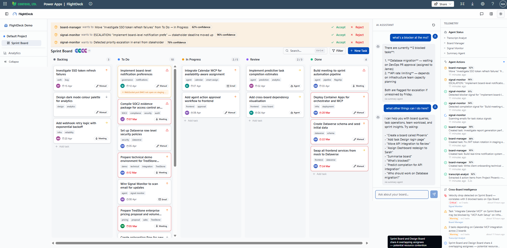

# FlightDeck — Agentic AI Kanban Board

An enterprise agentic Kanban board built as a **Power Apps Code App** (React + TypeScript + Vite). FlightDeck automatically ingests meeting transcripts via custom MCP servers, extracts action items with AI agents, populates and dynamically updates a Kanban board, and monitors email/chat signals to move cards in real-time.

The board includes a telemetry blade showing agent activity, analytics dashboards, AI chat with direct Foundry API integration, and human-in-the-loop approval for low-confidence agent actions.

**Target audience:** UK technology companies, consultancies, and MSPs needing automated meeting-to-action pipelines.


*FlightDeck running in Power Apps: Kanban board with AI-created tasks, approval banners for low-confidence agent actions, AI Chat assistant, and real-time telemetry showing agent activity and cross-board intelligence alerts.*

[**Try the Live Demo**](https://demo-dev.yellowmeadow-084e6936.uksouth.azurecontainerapps.io) — interactive auto-animating demo (no login required)

---

## What It Does

1. **Meeting transcripts come in** via Microsoft Teams webhooks or delegated Graph API access
2. **AI agents analyse** the transcript, extract action items, assign priorities, and identify owners
3. **Tasks appear on the board** in the right columns with full traceability back to the source meeting
4. **Signal monitoring** scans emails and Teams chat for completion, blocker, progress, and escalation signals
5. **Daily summaries** are generated automatically for stakeholder visibility
6. **Human-in-the-loop approval** for low-confidence agent actions before board changes are applied

---

## Architecture

```
┌─────────────────────────────────────────────────────────────────┐
│  Power Apps Host (Entra ID Auth, DLP, Governance)               │
├─────────────────────────────────────────────────────────────────┤
│  FlightDeck React SPA (Code App)                                │
│  ┌────────┬────────────────────────────┬──────────┬──────────┐  │
│  │Sidebar │     Kanban Board           │ AI Chat  │Telemetry │  │
│  │Org/Proj│  [Backlog][ToDo][InProg]   │ Panel    │ Blade    │  │
│  │Board   │  [Review][Done]            │ (direct  │ Agent    │  │
│  │Nav     │     DnD Cards              │  Foundry)│ Status   │  │
│  │        │                            │          │ Actions  │  │
│  │Analytics│ ┌──────────────────────┐  │          │ Metrics  │  │
│  │        │  │ Approval Banner      │  │          │ Activity │  │
│  └────────┴──┴──────────────────────┴──┴──────────┴──────────┘  │
├─────────────────────────────────────────────────────────────────┤
│  Service Layer (src/services/) — mock → Dataverse swap           │
├─────────────────────────────────────────────────────────────────┤
│  TanStack Query + Zustand State Management                       │
└────────────────┬──────────────────────┬─────────────────────────┘
                 │ @microsoft/power-apps│ Direct Foundry API
                 │ SDK (postMessage)    │ (chat panel)
                 ▼                      ▼
┌─────────────────────────────────────────────────────────────────┐
│  Dataverse Tables (9 tables, mc_ prefix, 11 lookup relations)   │
│  organization│project│board│column│task│comment│activitylog      │
│  agentaction │ boardmember                                       │
└────────┬─────────────────────────────┬──────────────────────────┘
         │ writes results              │ reads/queries
┌────────┴────────────┐     ┌──────────┴──────────────────────────┐
│ Container App       │     │ Work IQ MCP Servers                  │
│ (Orchestrator)      │     │ Mail│Calendar│Teams│User│SharePoint  │
├─────────────────────┤     │ Copilot│OneDrive│Word│Dataverse      │
│ Triggers:           │     └─────────────────────────────────────┘
│ • transcript-webhook│
│ • signal-scanner    │     ┌─────────────────────────────────────┐
│ • daily-summary     │     │ Custom Transcript MCP Servers        │
│ • subscription-renew│◄────┤ Delegated (OBO) — per-user transcripts│
└───┬───┬───┬───┬─────┘     │ Webhook (App) — tenant-wide events    │
    │   │   │   │           └─────────────────────────────────────┘
    ▼   ▼   ▼   ▼
┌──────────────────────────────────────────────────────┐
│ AI Foundry Agents (called via REST API)               │
│ ┌─────────────┐ ┌──────────────┐ ┌───────────────┐  │
│ │ Transcript  │ │ Board        │ │ Signal        │  │
│ │ Analyst     │ │ Manager      │ │ Monitor       │  │
│ │ (gpt-5)     │ │ (gpt-5-mini) │ │ (gpt-5-mini)  │  │
│ └─────────────┘ └──────────────┘ └───────────────┘  │
│ ┌─────────────┐                                      │
│ │ Summary     │                                      │
│ │ Agent       │                                      │
│ │ (gpt-5)     │                                      │
│ └─────────────┘                                      │
└──────────────────────────────────────────────────────┘
```

### Three-Layer Frontend Architecture

FlightDeck follows a strict three-layer separation to maximise testability and enable a clean swap from mock data to Dataverse.

```
Components (presentation) → Hooks (business logic + TanStack Query) → Services (Dataverse CRUD)
```

- **Layer 1 — Components:** React components handle rendering and user interaction only. They call hooks for data and mutations. No direct data fetching or business logic lives in components.
- **Layer 2 — Hooks:** Custom hooks encapsulate all business logic, TanStack Query configuration (query keys, refetch intervals, optimistic updates), and mutation wiring.
- **Layer 3 — Services:** Each service file re-exports from the Dataverse-generated service. The `@microsoft/power-apps` SDK handles all Dataverse communication via the CSP-safe `postMessage` bridge.

---

## Technology Stack

| Technology | Version | Purpose |
|---|---|---|
| React | 19.1.1 | UI framework |
| TypeScript | ~5.9.3 | Type safety |
| Vite | 7.1.7 | Build tool and dev server |
| Tailwind CSS | 4.1.16 | Utility-first styling |
| shadcn/ui (Radix primitives) | Various | UI component library |
| OKLCH colour system | — | Perceptually uniform colour space for themes |
| TanStack Query | 5.90.5 | Server state management (15s polling) |
| TanStack Table | 8.21.3 | Data table with sorting and filtering |
| Zustand | 5.0.10 | Client state management (2 stores) |
| @dnd-kit/core | 6.3.1 | Drag-and-drop framework |
| @dnd-kit/sortable | 10.0.0 | Sortable DnD primitives |
| Recharts | 2.15.4 | Analytics chart library |
| React Router | 7.9.4 | SPA routing with Power Apps BASENAME normalisation |
| date-fns | 4.1.0 | UK date formatting (en-GB locale) |
| lucide-react | 0.546.0 | Icon library |
| cmdk | 1.1.1 | Command palette (Ctrl+K) |
| sonner | 2.0.7 | Toast notifications |
| @microsoft/power-apps | 1.0.3 | Power Apps SDK (postMessage bridge) |
| ESLint | 9.36.0 | Linting |

---

## Features

### Kanban Board
- Drag-and-drop with @dnd-kit (`DndContext`, `PointerSensor`, `KeyboardSensor`, `closestCorners`)
- 5 columns: Backlog (grey), To Do (blue), In Progress (amber), Review (purple), Done (green)
- WIP limits with visual indicators and drag rejection when above limit
- Fractional indexing (`SORT_ORDER_GAP = 65536`) for DnD reordering
- Task detail panel (480px sheet slide-over) with 3 tabs: Details, Comments, Activity
- Inline editing: Select (priority, assignee, status), Calendar (due date), Checkbox (blocked state)
- Quick-add task input per column
- Keyboard-accessible DnD (arrow keys + space)
- Real-time polling (15s refetch interval via TanStack Query)

### Analytics Dashboard
- 4 summary cards: Total Tasks, Completion Rate %, Agent Contribution %, Overdue count
- Tasks by Status (bar chart using column colours)
- Tasks by Priority (donut chart using priority colours)
- Tasks by Source (donut chart)
- Activity Over Time (stacked area chart — agent vs human activity)
- Sortable/filterable data table (TanStack Table)
- Tabs: Charts | Data Table

### AI Chat Panel
- Direct Foundry API integration (no Copilot Studio or Direct Line dependencies)
- Chat with AI agents for board queries, task management, and insights
- Integrated into AppShell as collapsible right panel

### Telemetry Blade
- **Agent Status Panel** — 4 agents with status dots (green/amber/red), tooltips showing last action
- **Agent Action Feed** — real-time feed of agent actions with status badges, confidence %, duration
- **Board Metrics** — 2x2 grid: In Progress count, Completed count, trend icons, WIP progress bar
- **Activity Timeline** — vertical timeline with action-type icons, agent accent colouring

### Navigation & Search
- Hierarchical sidebar: Organisation → Project → Board (collapsible, w-14/w-56)
- Command palette (Ctrl+K) with cmdk — fuzzy search across all tasks
- Filter popover: checkbox filters for assignee, priority, source
- Board members popover with stacked avatars and role badges

### Governance
- Board settings page
- Project settings page
- Role-based access (owner/admin/member/viewer) via `useRoleAccess` hook
- Activity logging with actor attribution on all CRUD operations
- Human-in-the-loop approval banner for low-confidence agent actions (Accept/Reject)

### Keyboard Shortcuts
| Key | Action |
|---|---|
| `N` | Open New Task dialog |
| `T` | Toggle Telemetry blade |
| `[` | Toggle Sidebar |
| `?` | Open Keyboard Shortcuts dialog |
| `Ctrl+K` | Open Search / Command palette |

### Enterprise Features
- Code splitting: React.lazy + Suspense for all pages, manual chunks (vendor-react, vendor-radix, vendor-query, vendor-dnd)
- ErrorBoundary isolation per telemetry section and chart
- Responsive layout: auto-collapse sidebar (<768px), auto-collapse telemetry (<1280px)
- CSS width transitions for panel animations (preserves component state)
- OKLCH colour system for perceptually uniform dark/light themes
- UK date formatting throughout (en-GB locale via date-fns)
- Toast notifications on all mutations via sonner

---

## Dataverse Schema

9 custom tables with `mc_` publisher prefix. Full schema details in `docs/dataverse-setup.md`.

### Table Overview

| # | Table | Purpose | Key Columns |
|---|---|---|---|
| 1 | `mc_organization` | Top-level org grouping | name, logoUrl |
| 2 | `mc_project` | Project within an org | name, description, color, organizationId (lookup) |
| 3 | `mc_board` | Kanban board config | name, description, isDefault, agentsEnabled, pollInterval, projectId (lookup) |
| 4 | `mc_column` | Board column | name, columnType (choice), sortOrder, color, wipLimit, boardId (lookup) |
| 5 | `mc_task` | Kanban card/task | title, description, priority (choice), sortOrder, dueDate, source (choice), sourceReference, labels, meetingDate, completedDate, archivedDate, isBlocked, blockedReason, assigneeId, assigneeName, columnId (lookup), boardId (lookup) |
| 6 | `mc_comment` | Task comment | content, authorId, authorName, isAgent, taskId (lookup) |
| 7 | `mc_activitylog` | Audit trail | action (choice), description, actorId, actorName, isAgent, previousValue, newValue, taskId (lookup), boardId (lookup) |
| 8 | `mc_agentaction` | AI agent execution log | agentName, actionType, status (choice), confidence, durationMs, taskId (lookup), boardId (lookup) |
| 9 | `mc_boardmember` | Board membership | name, email, role (choice), avatarUrl, boardId (lookup) |

### Choice Column Values

| Choice | Values |
|---|---|
| **Column Type** (`mc_columntype`) | backlog (100000000), todo (100000001), in_progress (100000002), review (100000003), done (100000004), archived (100000005) |
| **Priority** (`mc_priority`) | critical (100000000), high (100000001), medium (100000002), low (100000003) |
| **Source** (`mc_source`) | manual (100000000), meeting_transcript (100000001), email (100000002), agent (100000003), import (100000004) |
| **Activity Action** (`mc_action`) | created (100000000), moved (100000001), updated (100000002), commented (100000003), assigned (100000004), completed (100000005), archived (100000006), deleted (100000007), agent_action (100000008) |
| **Agent Status** (`mc_status`) | pending (100000000), running (100000001), succeeded (100000002), failed (100000003), requires_approval (100000004) |
| **Member Role** (`mc_role`) | owner (100000000), admin (100000001), member (100000002), viewer (100000003) |

### Security Roles

| Role | organization | project | board | column | task | comment | activitylog | agentaction | boardmember |
|---|---|---|---|---|---|---|---|---|---|
| Board Owner | CRUD | CRUD | CRUD | CRUD | CRUD | CRUD | CR | CR | CRUD |
| Board Admin | R | R | RU | CRUD | CRUD | CRUD | CR | CR | CRU |
| Board Member | R | R | R | R | CRUD | CRUD | CR | R | R |
| Board Viewer | R | R | R | R | R | R | R | R | R |
| Agent Service | R | R | R | R | CRU | CR | CR | CRU | R |

---

## AI Foundry Agents

All agent definitions are stored as JSON in `infrastructure/agents/`. Agents are called via REST API from the Container App orchestrator and from the chat panel.

### 1. Transcript Analyst

| Property | Value |
|---|---|
| **Model** | gpt-5 (GPT-5.1) |
| **Temperature** | 0.1 |
| **Confidence Threshold** | 0.7 |
| **Output** | structured_json |

Analyses meeting transcripts and extracts structured action items. For each item, outputs title, description, assigneeName, priority, dueDate, sourceReference, meetingDate, confidence score, and labels.

**Rules:** Only extract items where someone committed to doing something. Ignore general discussion. Confidence below 0.7 if assignment or deadline is ambiguous. UK date format (DD/MM/YYYY).

**Tools:** `submit_action_items` — forwards extracted items to Board Manager for task creation.

### 2. Board Manager

| Property | Value |
|---|---|
| **Model** | gpt-5-mini |
| **Confidence Threshold** | 0.8 |
| **Approval Required** | Yes (when confidence < 0.8) |
| **Output** | structured_json |

Performs CRUD operations on the Kanban board. Handles task creation, column moves, assignee resolution (fuzzy matching), priority updates, and archiving. Never deletes tasks — only archives.

**Tools:** `manage_tasks` (Dataverse CRUD on `mc_task`), `log_activity` (create `mc_activitylog` entries), `lookup_members` (read `mc_boardmember` for assignee resolution).

### 3. Signal Monitor

| Property | Value |
|---|---|
| **Model** | gpt-5-mini |
| **Confidence Threshold** | 0.7 |
| **Output** | structured_json |

Watches email threads and Teams chat for signals indicating task status changes. Detects four signal types:
- **Completion:** "done", "finished", "deployed", "merged", "shipped"
- **Blocker:** "blocked", "waiting on", "depends on", "can't proceed"
- **Progress:** "started", "working on", "halfway through", "PR submitted"
- **Escalation:** "urgent", "critical", "ASAP", "SLA breach"

**Tools:** `read_tasks` (Dataverse, for fuzzy matching), `submit_recommendation` (forward recommended action to Board Manager).

### 4. Summary Agent

| Property | Value |
|---|---|
| **Model** | gpt-5 (GPT-5.1) |
| **Temperature** | 0.3 |
| **Output** | markdown |

Generates board insights and answers natural language queries. Capabilities: daily board summary, sprint velocity, team workload analysis, risk assessment, NL queries ("What is Sarah working on?", "Show me blocked tasks").

**Tools:** `read_board_data` (Dataverse `mc_task`), `read_activity` (Dataverse `mc_activitylog`).

> **Note:** gpt-5-mini does not support the `temperature` parameter.

---

## Autonomous Trigger Pipeline

The Container App orchestrator (Express + node-cron) drives four autonomous pipelines that trigger agent activity without user interaction.

### 1. transcript-webhook

**Trigger:** HTTP POST — Graph Change Notification on new meeting transcripts.

```
Graph Change Notification → Orchestrator → transcript-analyst → board-manager → tasks created
```

Receives webhook from Microsoft Graph, fetches transcript via Delegated MCP server, invokes Transcript Analyst to extract action items, then Board Manager to create tasks.

### 2. signal-scanner

**Trigger:** Timer — every 15 minutes.

```
15-min timer → signal-monitor → board-manager (if confidence >= 0.7)
```

Invokes Signal Monitor to scan recent emails and Teams messages. High-confidence recommendations (>= 0.7) are forwarded to Board Manager for automatic board updates. Low-confidence signals are logged for manual review.

### 3. daily-summary

**Trigger:** Timer — 08:00 UTC daily.

```
08:00 UTC timer → summary-agent → Teams notification
```

Invokes Summary Agent to generate a board digest (completed, in-progress, blocked, overdue, workload). Output posted as a Teams notification.

### 4. subscription-renewal

**Trigger:** Timer — midnight UTC daily.

```
Midnight timer → auto-renew Graph webhook subscription
```

Checks Graph webhook subscription expiry and renews if due to expire within 24 hours. Ensures continuous delivery of meeting transcript change notifications.

---

## State Management

### Zustand Stores

**`ui-store.ts`** — all UI state:
- Panel visibility: `telemetryBladeOpen`, `chatPanelOpen`, `sidebarOpen`, `sidebarCollapsed`
- Task detail: `selectedTaskId`, `taskDetailOpen`
- Dialogs: `newTaskDialogOpen`, `searchOpen`, `shortcutsDialogOpen`
- Filters: `FilterState` (search string, assigneeIds[], priorities[], sources[])

**`board-store.ts`** — navigation context:
- `currentOrgId`, `currentProjectId`, `currentBoardId`

### TanStack Query Keys

| Query Key | Polling | Source |
|---|---|---|
| `["tasks", boardId]` | 15s | `TasksService.getAll` |
| `["task", taskId]` | — | `TasksService.get` |
| `["columns", boardId]` | — | `ColumnsService.getAll` |
| `["agent-actions", boardId]` | 15s | `AgentActionsService.getAll` |
| `["activity-log", boardId]` | — | `ActivityLogService.getAll` |
| `["comments", taskId]` | — | `CommentsService.getAll` |
| `["board-members", boardId]` | — | `BoardMembersService.getAll` |
| `["organizations"]` | — | `OrganizationsService.getAll` |
| `["projects", orgId]` | — | `ProjectsService.getAll` |
| `["boards", projectId]` | — | `BoardsService.getAll` |

---

## TypeScript Interfaces

Defined in `src/lib/types.ts`:

| Interface | Purpose |
|---|---|
| `KanbanColumn` | Board column (id, name, boardId, sortOrder, color, wipLimit, columnType) |
| `KanbanTask` | Task/card (19 fields including title, priority, assignee, dates, source, labels) |
| `KanbanBoard` | Board metadata (id, name, projectId, agentsEnabled, pollInterval) |
| `ActivityLogEntry` | Audit trail entry (action, actor, isAgent, previous/new values) |
| `AgentAction` | AI agent execution record (agentName, actionType, status, confidence, durationMs) |
| `Organization` | Top-level org (id, name, logoUrl) |
| `Project` | Project within org (id, organizationId, name, description, color) |
| `BoardMember` | Board membership (id, boardId, name, email, role, avatarUrl) |
| `Comment` | Task comment (id, taskId, authorId, authorName, isAgent, content) |
| `FilterState` | Active filters (search, assigneeIds, priorities, sources) |
| `ColumnType` | Union: "backlog" \| "todo" \| "in_progress" \| "review" \| "done" \| "archived" |
| `Priority` | Union: "critical" \| "high" \| "medium" \| "low" |
| `TaskSource` | Union: "manual" \| "meeting_transcript" \| "email" \| "agent" \| "import" |

---

## Key Design Decisions

### 1. shadcn/ui over Fluent UI v9
The Power Apps Code App starter template ships with shadcn/ui (Radix primitives + Tailwind). Staying with the template convention avoids ~180KB of additional bundle size from Fluent UI v9.

### 2. TanStack Query polling over WebSockets
Power Apps Code Apps run inside the Power Apps host iframe and do not support persistent WebSocket connections. TanStack Query's `refetchInterval: 15000` (15 seconds) provides near-real-time updates via polling within platform constraints.

### 3. Fractional indexing for DnD reordering
`SORT_ORDER_GAP = 65536` provides fractional indexing. When a card is moved between two others, its sort order is set to the midpoint. The large gap allows ~16 levels of subdivision before needing a rebalance.

### 4. Service abstraction layer
Every service file re-exports from the Dataverse-generated service. The mock-to-Dataverse swap required only changing the import in each service file from inline mock data to the `@/generated/services/Mc*Service` export.

### 5. OKLCH colour system
OKLCH provides perceptually uniform colours — equal numeric steps produce equal visual contrast changes. Especially valuable for dark mode where hex/HSL colours can appear washed out.

### 6. CSS width transitions over conditional render
Sidebar and telemetry blade use CSS `transition: width` rather than conditional rendering. This preserves component state during open/close and enables smooth animations without remounting.

### 7. Centralised keyboard shortcuts
All shortcuts registered in a single `use-keyboard-shortcuts.ts` hook to prevent conflicts. Checks `document.activeElement` to avoid triggering while typing in inputs.

### 8. UK date formatting
All dates use en-GB locale via date-fns. Centralised `date-utils.ts` exports `formatDate`, `formatDateTime`, and `formatRelative`.

### 9. ErrorBoundary isolation
Each telemetry section and chart is wrapped in its own ErrorBoundary. If one chart crashes, only that section shows a fallback.

### 10. Power Apps SDK postMessage bridge
The `@microsoft/power-apps` SDK communicates with Dataverse via `postMessage` to the host iframe, bypassing CSP `connect-src 'none'` restrictions that block direct `fetch()` calls.

---

## Routes

| Path | Component | Description |
|---|---|---|
| `/` | `DashboardPage` | Main Kanban board with CommandBar and ApprovalBanner |
| `/analytics` | `AnalyticsPage` | 4 charts + data table |
| `*` | `NotFoundPage` | 404 fallback |

All routes are wrapped in `AppShell` (three-panel structure: Sidebar + Main + TelemetryBlade). The router uses Power Apps BASENAME normalisation:

```typescript
const BASENAME = new URL(".", location.href).pathname
```

---

## Project Structure

```
AI_Kanban/
├── docs/
│   ├── architecture.md                    # Detailed architecture documentation
│   └── dataverse-setup.md                 # Complete Dataverse schema guide (390 lines)
│
├── infrastructure/
│   ├── agents/
│   │   ├── transcript-analyst.json        # AI Foundry: transcript analysis (gpt-5)
│   │   ├── board-manager.json             # AI Foundry: board CRUD (gpt-5-mini)
│   │   ├── signal-monitor.json            # AI Foundry: signal detection (gpt-5-mini)
│   │   └── summary-agent.json             # AI Foundry: board insights (gpt-5)
│   ├── bicep/
│   │   ├── main.bicep                     # Azure IaC (375 lines)
│   │   └── parameters.json               # Bicep parameter values
│   ├── docker/
│   │   ├── Dockerfile.mcp-delegated       # MCP: delegated (OBO) transcripts
│   │   ├── Dockerfile.mcp-webhook         # MCP: webhook (app-level) events
│   │   ├── docker-compose.yml             # Local dev compose
│   │   └── .dockerignore
│   ├── functions/
│   │   ├── src/index.js                   # Orchestrator (4 triggers)
│   │   ├── host.json                      # Functions host config
│   │   ├── local.settings.json            # Local dev settings
│   │   └── package.json
│   └── scripts/                           # Dataverse setup & seed scripts
│
├── src/
│   ├── components/
│   │   ├── analytics/                     # Charts (4), data table, chart skeleton
│   │   ├── chat/                          # AI chat panel (direct Foundry API)
│   │   ├── kanban/                        # Board, columns, cards, detail panel,
│   │   │                                  # approval banner, filters, search, members
│   │   ├── layout/                        # AppShell, CommandBar, Sidebar, TopBar
│   │   ├── shared/                        # ErrorBoundary, PriorityIcon, SourceBadge,
│   │   │                                  # UserAvatar, KeyboardShortcutsDialog
│   │   ├── telemetry/                     # TelemetryBlade, AgentStatusPanel,
│   │   │                                  # AgentActionFeed, BoardMetrics,
│   │   │                                  # ActivityTimeline, TelemetrySkeleton
│   │   └── ui/                            # shadcn/ui primitives (21 files)
│   │
│   ├── generated/                         # Dataverse client, services (9), choice maps,
│   │                                      # FoundryAgentClient
│   ├── hooks/                             # 12 custom hooks (TanStack Query + business logic)
│   ├── lib/                               # Types (13), constants, date-utils, utils
│   ├── pages/                             # Route pages (lazy-loaded)
│   ├── providers/                         # QueryProvider, ThemeProvider, SonnerProvider
│   ├── services/                          # 10 service re-exports + chat-service
│   └── stores/                            # Zustand: ui-store, board-store
│
├── components.json                        # shadcn/ui configuration
├── eslint.config.js                       # ESLint flat config
├── vite.config.ts                         # Vite + Power Apps plugin
├── tsconfig.json                          # TypeScript config
└── package.json                           # Dependencies and scripts
```

---

## Azure Deployment

### Resource Group: `rg-flightdeck` (uksouth)

| Resource | Type | Status |
|---|---|---|
| `ai-flightdeck` (S0) | AI Services | Deployed |
| `flightdeck-project` | AI Foundry Project | Deployed |
| gpt-5 (GPT-5.1, 50K TPM) | Model Deployment | Deployed |
| gpt-5-mini (50K TPM) | Model Deployment | Deployed |
| `crflightdeck.azurecr.io` | Container Registry (Basic) | Deployed |
| `log-flightdeck-dev` | Log Analytics | Deployed |
| `appi-flightdeck-dev` | Application Insights | Deployed |
| `kv-flightdeck-dev` | Key Vault | Deployed |
| `id-flightdeck-dev` | Managed Identity (AcrPull) | Deployed |
| `cae-flightdeck-dev` | Container Apps Environment | Deployed |
| `orchestrator-dev` | Container App (Express + node-cron) | Deployed |
| `mcp-delegated-dev` | Container App (MCP delegated) | Awaiting images |
| `mcp-webhook-dev` | Container App (MCP webhook) | Awaiting images |
| `stflightdeckdev` | Storage Account | Deployed |
| FlightDeck MCP Servers | Entra App Registration | Deployed |

### Endpoints

- **Foundry:** `https://ai-flightdeck.services.ai.azure.com/api/projects/flightdeck-project`
- **ACR:** `crflightdeck.azurecr.io`
- **Key Vault:** `https://kv-flightdeck-dev.vault.azure.net/`
- **Orchestrator:** `orchestrator-dev.yellowmeadow-084e6936.uksouth.azurecontainerapps.io`
- **MCP Delegated:** `mcp-delegated-dev.yellowmeadow-084e6936.uksouth.azurecontainerapps.io`
- **MCP Webhook:** `mcp-webhook-dev.yellowmeadow-084e6936.uksouth.azurecontainerapps.io`
- **Dataverse:** `https://orged45fd63.crm.dynamics.com`

---

## Metrics

| Category | Count |
|---|---|
| Source lines of code (src/) | ~8,100 |
| Infrastructure lines (IaC + agents) | ~926 |
| React components | 44 |
| Custom hooks | 12 |
| Service files | 10 |
| UI primitives (shadcn) | 21 |
| Zustand stores | 2 |
| Routes | 2 (+404) |
| Dataverse tables | 9 |
| AI Foundry agents | 4 |
| Orchestrator triggers | 4 |
| TypeScript interfaces | 13 |

---

## Getting Started

### Prerequisites
- Node.js 20+
- Power Apps CLI (`pac`)
- Azure subscription (for Foundry agents and Container Apps)

### Development
```bash
npm install
npm run dev
```

### Build & Deploy
```bash
npm run build
pac pcf push --publisher-prefix mc
```

### Infrastructure
```bash
# Deploy Azure resources
az deployment group create \
  --resource-group rg-flightdeck \
  --template-file infrastructure/bicep/main.bicep
```

### Dataverse Setup
See `docs/dataverse-setup.md` for complete table creation guide, column definitions, choice columns, lookup relationships, and `pac code add-data-source` commands.

---

## Phase Build Log

| Phase | Focus | Status |
|---|---|---|
| **1** | Thin vertical slice — AppShell, KanbanBoard with DnD, 5 columns, 8 mock tasks, TelemetryBlade, theme toggle | Complete |
| **2** | Full board — Sidebar nav, TaskDetailPanel, CommandBar, activity logging, board members, WIP limits | Complete |
| **3** | Telemetry + Analytics — Composable telemetry components, 4 Recharts charts, data table, keyboard shortcuts, responsive layout | Complete |
| **4** | Service layer + Infrastructure — 10 services, Bicep IaC, 4 agent definitions, orchestrator, agent telemetry UI, approval banner | Complete |
| **5** | AI Chat + Governance + Production — Chat panel, board/project settings, code splitting, a11y, role-based access | In progress |

---

## Competitive Landscape

FlightDeck occupies a unique position in the market. While several products handle parts of the meeting-to-task pipeline, none combine all of them into a single, self-updating board inside the Microsoft enterprise stack.

### Feature Comparison

| Capability | FlightDeck | Fireflies.ai | Tactiq | Fellow.ai | Grain | Notion AI | M365 Copilot |
|---|---|---|---|---|---|---|---|
| Meeting transcript → action items | Yes (AI Foundry agents) | Yes | Yes | Yes | Yes | Partial | Yes (recap) |
| Auto-create tasks on board | Yes (direct to Dataverse) | Yes (Asana, Trello) | Partial (Linear, HubSpot) | Partial (assigns, no board) | No (CRM only) | Theoretically | Partial (manual) |
| Email/chat signal monitoring | Yes (completion, blocker, escalation) | No | No | No | No | No | No |
| Auto-move cards from signals | Yes | No | No | No | No | No | No |
| Built-in Kanban board | Yes | No (pushes to external tools) | No | No | No | Yes (Notion boards) | No (Planner is separate) |
| Human-in-the-loop approval | Yes (confidence threshold) | No | No | No | No | No | No |
| Agentic pipeline (multi-agent) | Yes (4 chained agents) | No | No | No | No | Partial (new) | No |
| Power Platform native | Yes (Dataverse, DLP, Entra) | No | No | No | No | No | Partial |
| Daily board summaries | Yes (auto-posted to Teams) | No | No | No | No | No | No |

### What Makes FlightDeck Different

1. **Closed-loop agentic pipeline** — Transcript → AI extraction → task creation → signal monitoring → card movement → daily summary. No other product chains multiple autonomous agents in a continuous feedback loop that keeps the board current without human intervention.

2. **Signal monitoring from email and chat** — No competitor scans email and Teams messages to automatically move cards based on detected completion, blocker, progress, or escalation signals. Existing tools are transcript-in, tasks-out only.

3. **Human-in-the-loop with confidence scoring** — Actions above 0.8 confidence are auto-applied; below that threshold, they go to the approval banner for human review. No competitor offers this graduated autonomy model.

4. **Power Platform native** — Built as a Power Apps Code App with Dataverse as the data store. Operates inside the Microsoft governance, DLP, and identity perimeter. Enterprise IT teams get compliance without a third-party SaaS.

5. **Board and intelligence in one app** — Competitors are either meeting assistants that push to external boards (Fireflies → Trello) or boards without meeting intelligence (Planner, Trello, Jira). FlightDeck is both.

### Where Competitors Are Stronger

- **Fireflies / Otter / Grain** — More mature transcription engines, wider language support, larger ecosystems, consumer-friendly pricing
- **M365 Copilot** — Included with E3/E5 licences, zero deployment, massive user base, deep Teams integration
- **Notion AI** — Broader productivity platform, consumer appeal, large community, flexible database model

### Open Source

A GitHub search for repositories combining meeting transcripts, AI agents, and Kanban task creation returned **zero results**. The only related repos are small personal projects with zero stars (basic PDF action item extractors). No open-source project attempts what FlightDeck does.

### When FlightDeck Makes Sense

- Organisations already on Microsoft 365 / Power Platform wanting to stay in-ecosystem
- Teams that lose action items between meetings and email threads
- Environments requiring DLP policies, Entra ID governance, and audit trails
- Consultancies and MSPs managing multiple client boards with high meeting volume

### When a Competitor Makes More Sense

- Small teams wanting a free/cheap tool with no deployment (Fireflies, Otter)
- Organisations already paying for M365 Copilot and happy with manual Planner task creation
- Teams not on the Microsoft stack (Notion AI for non-Microsoft shops)

---

## Licence

Proprietary. All rights reserved.
